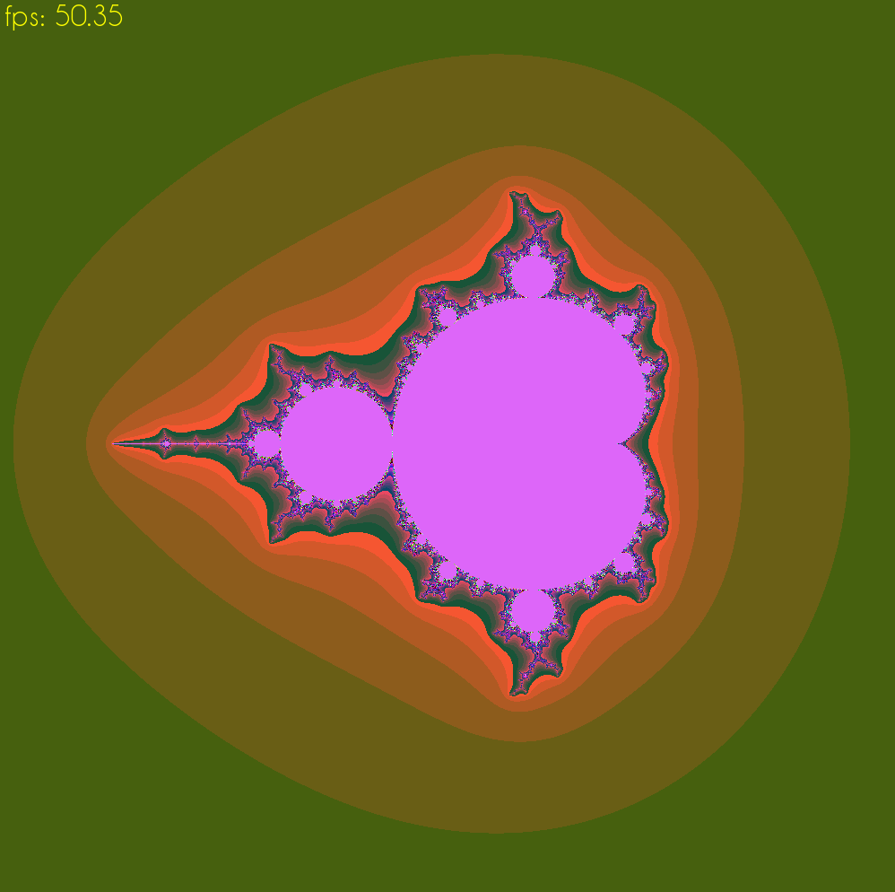

# Проект "Множество Мандельброта"
## Описание проекта
Основной целью данного проекта является тестирование различных оптимизаций больших вычислений. Одним из самых популярных способов тестирования графических оптимизаций является построение множества Мандельброта и измерение времени, затрачиваемого на расчеты. Построим такое множество и посмотрим, как разные оптимизации влияют на время работы алгоритма.
## Инструменты и реализация
Для визуализации множества Мандельброта будем использовать библиотеку SFML для C++.
Сначала напишем простую, "лобовую" реализацию алгоритма вычисления множества. С помощью модуля Clock библиотеки SFML будем засекать время, затрачиваемое на вычисление цвета всех точек множества.
Для ускорения вычислений будем использовать Intrinsic functions, которые воплощают конвеерную реализацию вычислений с использованием AVX2 (Advanced Vector Extensions, расширение системы команд x86 процессоров Intel и AMD). Эти функции (Intrinsics) возьмем из библиотеки "imintrin.h" для C++.
## Реализованные функции
В окне SFML реализована визуализация множества Мандельброта. Реализована возможность изменения параметров рисунка путем нажатия следующих клавиш:
- <kbd>&#x2191;</kbd> - подвинуть картинку вверх;
- <kbd>&#x2193;</kbd> - подвинуть картинку вниз;
- <kbd>&#8594;</kbd> - подвинуть картинку вправо;
- <kbd>&#8592;</kbd> - подвинуть картинку влево;
- <kbd>F10</kbd> - уменьшить картинку;
- <kbd>F11</kbd> - увеличить картинку.

Сама картинка выглядит следующим образом:

## Иструкция по сборке и запуску
Чтобы запустить программу, необходимо использовать Makefile, прилагающийся к проекту. Для этого после клонирования этого репозитория на ваш компьютер  необходимо в теминале из папки репозитория набрать "make". В самом Makefile необходимо указать нужный тип оптимизации (см. ниже). В коде программы при помощи условной компиляции можно включать и выключать использование AVX2 (флаг AVX) и отрисовку множества (флаг DRAW).

## Как достичь максимальной скорости вычислений? 

### С отрисовкой
Проведем измерения FPS (количество кадров в секунду, что соответствует количеству рассчетов целого множества в секунду) при включенной отрисовке множества.

| Флаг оптимизации |       AVX2, fps        |    Без AVX2, fps    | Ускорение, раз |
| :------:         | :---------------: | :------------: | :------------: |
|    none          |       13.3        |       4.4      |       3.0      |
|    -O3           |       35.4        |       8.4      |       4.2      |
|   -Ofast         |       37.2        |       8.6      |       4.3      |

Как мы видим, ускорение вычислений не соответствует ожидаемому результату. На время работы программы в значительной степени влияет время, которое библиотека SFML тратит на отрисовку множества. Программно уберем отрисовку (сделаем пустое окно) и посмотрим, какого ускорения мы сможем достичь в этом случае. 

### Без отрисовки
Проведем замеры FPS для разных оптимизаций при отключенной отрисовке.
| Флаг оптимизации |       AVX2, fps        |    Без AVX2, fps    | Ускорение, раз |
| :------:         | :---------------: | :------------: | :------------: |
|       none       |       15.6        |       4.6      |       3.4      |
|       -O1        |       57.9        |       8.9      |       6.5      |
|       -O2        |       60.0        |       9.0      |       6.7      |
|       -O3        |       58.6        |       9.1      |       6.4      |
|       -Ofast     |       64.2        |       9.4      |       6.8      |

Как мы видим, отключение отрисовки существенно сказалось на времени работы программы. При малых FPS влияние отрисовки мало: 4.4 fps превратилось в 4.6 fps, ускорение в 1.05 раза. При высоких скоростях вычислений отрисовка занимает около 42% времени, что позволяет увеличить fps с 37.2 до 64.2 при её отключении.

## Сравнение результатов и выводы
Итого, мы получили, что использование AVX2 позволяет сократить время работы программы в 3-7 раз (в зависимости от типа компиляторной оптимизации). Таким образом, AVX2 в некоторых случаях может "обогнать" по времени компиляторные оптимизации, примененные к стандартному алгоритму. Одним из примеров объемных вычислений, для которых AVX-команды наиболее эффективны, и является множество Мандельброта, которое было исследовано в данном проекте.

Также необходимо отметить, что результаты измерений fps сильно зависят от многих факторов: от типа и модели процессора, от его загруженности и даже температуры. Результаты, представленные в работе, соответствуют запуску программы на процессоре Intel Core i5 при использовании Linux Mint 21. Все результаты получены при соблюдении практически одинаковых внешних условий. Однако, например, при других условиях запуска при максимальном использовании оптимизаций удается получить до 82 fps. Результаты измерений могут количественно отличаться в зависимости от условий запуска программы, но все качественные зависимости и тенденции, отмеченные в работе, сохранятся.